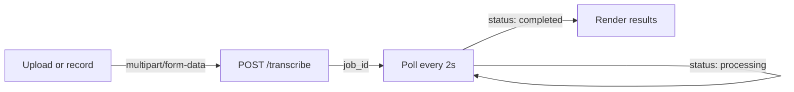

# Voxake — Frontend

> Voice memos, set in print.

**[voxake-frontend.vercel.app](https://voxake-frontend.vercel.app)**

---

## What it is

Voxake turns a voice memo into a structured editorial dispatch — every task numbered, every decision marked, every person named. Upload a recording or drop a WhatsApp voice note. The rest is automatic.

---

## How it works



Three states, one page:

| State | What happens |
|-------|-------------|
| **Idle** | Record via mic or drag-and-drop an audio file |
| **Processing** | Progress bar advances through transcribing → extracting → done |
| **Done** | Editorial broadsheet — transcript, tasks, decisions, people |

---

## The result page

Each memo becomes a dispatch:

- **The Memo** — full transcript with editorial drop cap
- **In Summary** — 2–3 § bullets on what the memo touched
- **Tasks of Record** — numbered, with assignee, deadline, and priority in rust-red
- **Decisions** — each marked with §
- **Named Persons** — serif initials avatar, name, role

---

## Stack

| | |
|--|--|
| **Framework** | Next.js 16 — App Router |
| **Language** | TypeScript |
| **Recording** | MediaRecorder API — in-browser audio capture |
| **Styling** | Inline styles — Georgia serif body, Helvetica Neue labels, warm paper stock |
| **Deployment** | Vercel — auto-deploy on push to main |

---

## Running locally

```bash
npm install
```

Create `.env`:

```
NEXT_PUBLIC_API_URL=http://localhost:8000
```

```bash
npm run dev
# http://localhost:3000
```

Point `NEXT_PUBLIC_API_URL` at the live backend to test against production

---

## Environment variables

| Variable | Value |
|----------|-------|
| `NEXT_PUBLIC_API_URL` | Backend base URL — set in Vercel dashboard for production |

---

## Deployment

Push to `main` → Vercel builds and deploys automatically. Environment variables are managed in the Vercel dashboard, not committed to the repo.

---

## Backend

API source and documentation → [github.com/ismailingg/Voxake](https://github.com/ismailingg/Voxake)